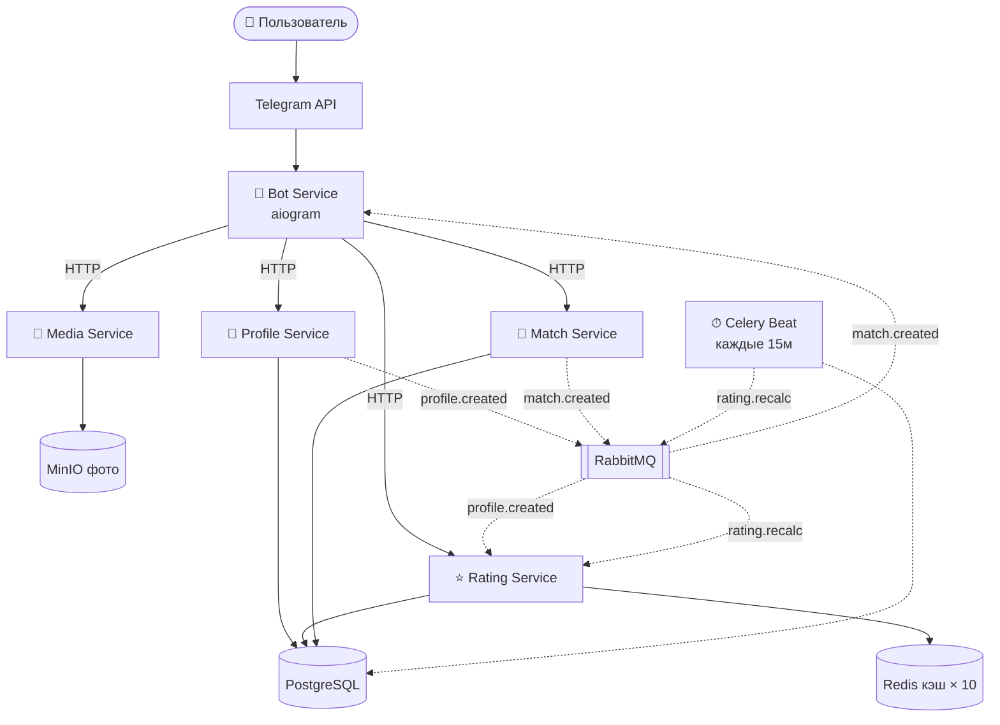

# Dating Telegram Bot

Телеграм-бот для знакомств с микросервисной архитектурой. Пользователи заполняют анкету, просматривают анкеты других, ставят лайки и получают мэтчи.

---

## Описание сервисов

### Bot Service (aiogram)
Единственная точка входа для пользователя. Принимает команды из Telegram, управляет FSM-состояниями при заполнении анкеты (имя → возраст → город → фото), показывает чужие анкеты с кнопками «❤️ Лайк» / «👎 Пропуск», отправляет уведомления о мэтчах. Общается с остальными сервисами по HTTP, события получает из RabbitMQ.

| Команда | Действие |
|---|---|
| `/start` | Регистрация по `telegram_id`, запуск заполнения анкеты |
| `/profile` | Просмотр и редактирование своей анкеты |
| `/search` | Запуск просмотра анкет других пользователей |
| `/matches` | Список взаимных совпадений |

### Profile Service (FastAPI)
Отвечает за хранение и управление анкетами. Предоставляет CRUD-эндпоинты для работы с профилем. После создания или обновления анкеты публикует событие в RabbitMQ — Rating Service реагирует и пересчитывает первичный рейтинг.

Поля анкеты: имя, возраст, пол, город, описание, список интересов, предпочтения по партнёру (пол, возраст, город).

### Rating Service (FastAPI + Redis)
Реализует трёхуровневый алгоритм ранжирования и формирует персональную ленту анкет. При старте сессии первая анкета проходит полный расчёт, одновременно в Redis предзагружаются следующие 10. Пользователь получает их мгновенно из кэша. На последней из 10 цикл повторяется автоматически.

Уровни рейтинга:
- **Уровень 1** — первичный: полнота анкеты, количество фото, заполненность предпочтений
- **Уровень 2** — поведенческий: лайки, пропуски, мэтчи, активность
- **Уровень 3** — комбинированный: взвешенная сумма уровней 1 и 2

### Match Service (FastAPI)
Принимает события лайков. При каждом лайке проверяет взаимность — если встречный лайк уже есть, создаёт мэтч и публикует событие `match.created` в RabbitMQ. Bot Service подхватывает событие и уведомляет обоих пользователей.

### Media Service (FastAPI + MinIO)
Принимает фотографии, сохраняет в S3-совместимое хранилище MinIO, возвращает `s3_key`. Profile Service хранит только ключ, сам файл живёт в MinIO. Максимум 5 фото на профиль.

---

## Схема архитектуры



---

## Схема данных в БД

```sql
-- Пользователи (регистрация по telegram_id при /start)
CREATE TABLE users (
    id          UUID PRIMARY KEY DEFAULT gen_random_uuid(),
    telegram_id BIGINT UNIQUE NOT NULL,
    username    VARCHAR(64),
    created_at  TIMESTAMPTZ DEFAULT NOW(),
    is_active   BOOLEAN DEFAULT TRUE
);

-- Анкеты пользователей
CREATE TABLE profiles (
    id           UUID PRIMARY KEY DEFAULT gen_random_uuid(),
    user_id      UUID UNIQUE NOT NULL REFERENCES users(id) ON DELETE CASCADE,
    name         VARCHAR(100) NOT NULL,
    age          SMALLINT NOT NULL CHECK (age BETWEEN 18 AND 100),
    gender       VARCHAR(10) NOT NULL,   -- 'male' | 'female' | 'other'
    city         VARCHAR(100),
    bio          TEXT,
    interests    TEXT[],                 -- ['спорт', 'кино', ...]
    pref_age_min SMALLINT DEFAULT 18,
    pref_age_max SMALLINT DEFAULT 60,
    pref_gender  VARCHAR(10),
    pref_city    VARCHAR(100),
    photos_count SMALLINT DEFAULT 0,
    is_visible   BOOLEAN DEFAULT TRUE,
    updated_at   TIMESTAMPTZ DEFAULT NOW()
);

-- Фотографии профилей (ключи файлов в MinIO)
CREATE TABLE photos (
    id         UUID PRIMARY KEY DEFAULT gen_random_uuid(),
    profile_id UUID NOT NULL REFERENCES profiles(id) ON DELETE CASCADE,
    s3_key     VARCHAR(255) NOT NULL,
    order_num  SMALLINT DEFAULT 0,
    created_at TIMESTAMPTZ DEFAULT NOW()
);

-- Рейтинги (хранятся отдельно, пересчитываются через Celery)
CREATE TABLE ratings (
    profile_id      UUID PRIMARY KEY REFERENCES profiles(id) ON DELETE CASCADE,
    primary_score   FLOAT DEFAULT 0.0,   -- уровень 1: полнота анкеты
    behavior_score  FLOAT DEFAULT 0.0,   -- уровень 2: лайки / пропуски / мэтчи
    combined_score  FLOAT DEFAULT 0.0,   -- уровень 3: итоговый взвешенный
    likes_count     INTEGER DEFAULT 0,
    skips_count     INTEGER DEFAULT 0,
    recalculated_at TIMESTAMPTZ DEFAULT NOW()
);

-- Лайки и пропуски
CREATE TABLE interactions (
    id            UUID PRIMARY KEY DEFAULT gen_random_uuid(),
    from_user_id  UUID NOT NULL REFERENCES users(id),
    to_profile_id UUID NOT NULL REFERENCES profiles(id),
    action        VARCHAR(10) NOT NULL,  -- 'like' | 'skip'
    created_at    TIMESTAMPTZ DEFAULT NOW(),
    UNIQUE(from_user_id, to_profile_id)
);

-- Взаимные мэтчи
CREATE TABLE matches (
    id         UUID PRIMARY KEY DEFAULT gen_random_uuid(),
    user1_id   UUID NOT NULL REFERENCES users(id),
    user2_id   UUID NOT NULL REFERENCES users(id),
    created_at TIMESTAMPTZ DEFAULT NOW(),
    is_active  BOOLEAN DEFAULT TRUE,
    UNIQUE(user1_id, user2_id)
);

-- Индексы
CREATE INDEX idx_ratings_combined  ON ratings(combined_score DESC);
CREATE INDEX idx_profiles_city_age ON profiles(city, age);
CREATE INDEX idx_interactions_from ON interactions(from_user_id);
CREATE INDEX idx_matches_users     ON matches(user1_id, user2_id);
```
